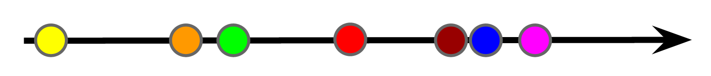
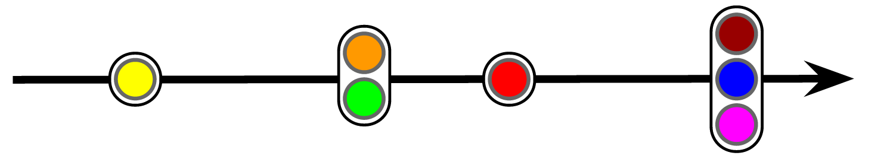
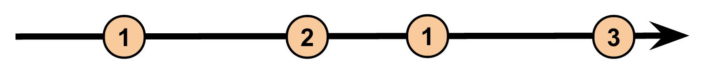
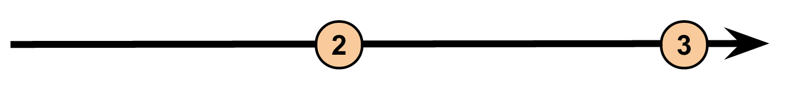

Run HelloWorld : it will run locally
```
mvn clean install exec:java -Dexec.mainClass=HelloWorld
```

Run HelloWorldWithCloudDeployement : it will run on the cloud
```
mvn  clean install exec:java -Dexec.mainClass=HelloWorldWithCloudDeployement -Dexec.args=" --project=<YourProjectId>  --runner=BlockingDataflowPipelineRunner --stagingLocation=gs://<yourbucket>/test/staging"
```

Inspired by : "The introduction to Reactive Programming you've been missing"
https://gist.github.com/staltz/868e7e9bc2a7b8c1f754

In this example we will use Dataflow to filter "ticks" on a 250ms fixed windows.
If a window contains one tick, it is removed.

###### Here is the Timeline with ticks :


###### Code for creating and adding data to a Pipeline
```java
    // Create data
    List<TimestampedValue<String>> data = Arrays.asList(
        TimestampedValue.of("b", new Instant(currentTimeMillis)),
        TimestampedValue.of("b", new Instant(currentTimeMillis+251)),
        TimestampedValue.of("b", new Instant(currentTimeMillis+253)),
        TimestampedValue.of("b", new Instant(currentTimeMillis+501)),
        TimestampedValue.of("b", new Instant(currentTimeMillis+770)),
        TimestampedValue.of("b", new Instant(currentTimeMillis+774)),
        TimestampedValue.of("b", new Instant(currentTimeMillis+778)),
        TimestampedValue.of("b", new Instant(currentTimeMillis+1780)),
        TimestampedValue.of("b", new Instant(currentTimeMillis+11756)));

    // Apply the Data to the pipeline
    PCollection<String> items = p.apply(Create.timestamped(data));
```

###### Grouping ticks by fixed window of 250ms

```java
    // Create 250ms windows
    Window.Bound<String> window = Window.<String>into(FixedWindows.of(Duration.millis(250)));
    PCollection<String> fixed_windowed_items = items.apply(window);
```

###### Counting ticks in a window

```java
    // Count elements in windows
    PCollection<KV<String, Long>> windowed_counts = fixed_windowed_items.apply(Count.<String>perElement());
```

###### Filtering all the window with one tick

```java
    // Remove remove all data < 2
    PCollection<KV<String, Long>> windowed_filtered = windowed_counts.apply(ParDo.of(new FilterGreaterThan()));
```


